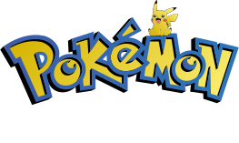

POKE-API PROJECT

  <a href="https://thepokemongallery.netlify.app/" target="_blank">
    
  <a/>

<h1 align="center">The Pokemon Gallery</h1>

 

Alphenx - Full Stack Developer

<!-- LINK - BADGES -->

  
  
  
  

 

<!-- TABLE OF CONTENTS -->

  <a href="#about">About</a> •
  <a href="#built-with">Built with</a> •
  <a href="#code-quality">Code Quality</a> •
  <a href="#demo">Demo</a>

<h3 align="center">
  This is a web application that allows users to explore and discover more about Pokémons. The application is designed using React and Styled Components to provide an interactive and visually appealing experience. The data is obtained from the PokeApi and the code is clean and secure thanks to the use of Jest for testing and Sonar for quality control.
</h3>

 

## Built with

> **Code**           **Production**        **Quality tools**        

 

## Code Quality

Writing clean and scalable code is crucial to the success of any web development project. That's why I prioritize testing code using Jest to ensure it meets industry standards and best practices. I also use SonarCloud to provide real-time feedback on code quality and catch any issues early on. By prioritizing clean code and testing, we can create applications that are efficient, maintainable, and able to meet the needs of users both now and in the future.

  
  

Overall, I believe that using tools like Jest and SonarCloud to test and analyze code is critical to the success of any web development project. By prioritizing clean code and testing, we can create applications that are not only efficient but also scalable, maintainable, and able to meet the needs of users both now and in the future.

 

Here are the REAL TIME badges with the end result of SonarCloud scans:

 

 

 

## Demo

 

  <a href="https://thepokemongallery.netlify.app/" target="_blank">
    
  This project is deployed in Netlify, check it out by clicking on this link!
  </a>

 
 

<a href="/LICENSE">MIT License</a> - Copyright © 2023 - <a href="https://github.com/Alphenx">Adrián García Iglesias</a>

